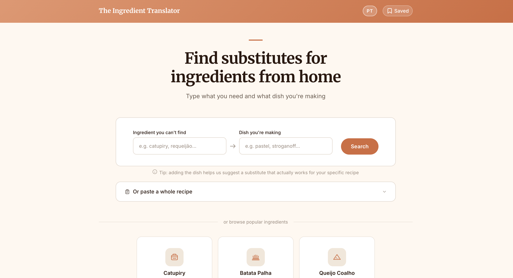

# The Ingredient Translator

An AI-powered tool that helps Brazilian immigrants find substitutes for Brazilian ingredients at American grocery stores.



## What it does

You type a Brazilian ingredient you can't find (like catupiry, batata palha, or queijo coalho) and the dish you're making. The app returns up to 3 substitutes ranked by match percentage, with specific products to buy, where to find them, and how to use them in your recipe.

It also supports pasting a full recipe — the AI identifies which ingredients are hard to find and suggests substitutes for each one.

## Features

- Search by ingredient + dish for context-aware substitutes
- Paste a whole recipe to find all specialty ingredients at once
- Match percentage showing how close each substitute is
- Store and aisle guidance for Walmart, Target, Kroger, Whole Foods, Trader Joe's
- Save substitutes for later
- Portuguese / English toggle with auto-detection based on browser language
- Spelling correction for Portuguese ingredient names

## Tech stack

- **Frontend:** Vanilla JS (ES6 modules), no framework
- **Backend:** Node.js + Express
- **AI:** OpenAI GPT-4o-mini with JSON mode
- **Caching:** Persistent JSON file cache keyed by ingredient + dish + language
- **Deployment:** Railway

## Live site

[sabordecasa-production.up.railway.app](https://sabordecasa-production.up.railway.app)

## Running locally

```bash
npm install
npm start
```

Requires a `.env` file with:

```
OPENAI_API_KEY=your_key_here
```
